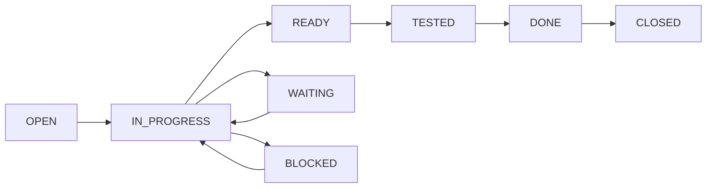

# MCP Ticketer

[](https://pypi.org/project/mcp-ticketer)
[](https://pypi.org/project/mcp-ticketer)
[](https://mcp-ticketer.readthedocs.io/en/latest/?badge=latest)
[](https://github.com/mcp-ticketer/mcp-ticketer/actions)
[](https://codecov.io/gh/mcp-ticketer/mcp-ticketer)
[](https://opensource.org/licenses/MIT)
[](https://github.com/psf/black)

Universal ticket management interface for AI agents with MCP (Model Context Protocol) support.

## 🚀 Features

- **🎯 Universal Ticket Model**: Simplified to Epic, Task, and Comment types
- **🔌 Multiple Adapters**: Support for JIRA, Linear, GitHub Issues, and AI-Trackdown
- **🤖 MCP Integration**: Native support for AI agent interactions
- **⚡ High Performance**: Smart caching and async operations
- **🎨 Rich CLI**: Beautiful terminal interface with colors and tables
- **📊 State Machine**: Built-in state transitions with validation
- **🔍 Advanced Search**: Full-text search with multiple filters
- **🔗 Hierarchy Navigation**: Parent issue lookup and filtered sub-issue retrieval
- **👤 Smart Assignment**: Dedicated assignment tool with URL support and audit trails
- **🏷️ Label Management**: Intelligent label organization, deduplication, and cleanup with fuzzy matching
- **📎 File Attachments**: Upload, list, and manage ticket attachments (AITrackdown adapter)
- **📝 Custom Instructions**: Customize ticket writing guidelines for your team
- **🔬 PM Monitoring Tools**: Detect duplicate tickets, identify stale work, and find orphaned tickets
- **📦 Easy Installation**: Available on PyPI with simple pip install
- **🚀 Auto-Dependency Install**: Automatic adapter dependency detection and installation
- **💾 Compact Mode**: 70% token reduction for AI agent ticket list queries (v0.15.0+)

## 📦 Installation

### From PyPI (Recommended)

```bash
pip install mcp-ticketer

# Install with specific adapters
pip install mcp-ticketer[jira]      # JIRA support
pip install mcp-ticketer[linear]    # Linear support
pip install mcp-ticketer[github]    # GitHub Issues support
pip install mcp-ticketer[analysis]  # PM monitoring tools
pip install mcp-ticketer[all]       # All adapters and features
```

**Note (v0.15.0+)**: The `setup` command now automatically detects and installs adapter dependencies! When you run `mcp-ticketer setup`, it will prompt you to install any missing adapter-specific dependencies, eliminating the need for manual `pip install mcp-ticketer[adapter]` after setup.

### From Source

```bash
git clone https://github.com/mcp-ticketer/mcp-ticketer.git
cd mcp-ticketer
pip install -e .
```

### Requirements

- Python 3.9+
- Virtual environment (recommended)

## 🤖 Supported AI Clients

MCP Ticketer integrates with multiple AI clients via the Model Context Protocol (MCP):

| AI Client | Support | Config Type | Project-Level | Setup Command |
|-----------|---------|-------------|---------------|---------------|
| **Claude Code** | ✅ Native | JSON | ✅ Yes | `mcp-ticketer install claude-code` |
| **Claude Desktop** | ✅ Full | JSON | ❌ Global only | `mcp-ticketer install claude-desktop` |
| **Gemini CLI** | ✅ Full | JSON | ✅ Yes | `mcp-ticketer install gemini` |
| **Codex CLI** | ✅ Full | TOML | ❌ Global only | `mcp-ticketer install codex` |
| **Auggie** | ✅ Full | JSON | ❌ Global only | `mcp-ticketer install auggie` |

### Quick MCP Setup

```bash
# Initialize adapter first (required)
mcp-ticketer init --adapter aitrackdown

# Auto-detection (Recommended) - Interactive platform selection
mcp-ticketer install                       # Auto-detect and prompt for platform

# See all detected platforms
mcp-ticketer install --auto-detect         # Show what's installed on your system

# Install for all detected platforms at once
mcp-ticketer install --all                 # Configure all detected AI clients

# Or install for specific platform
mcp-ticketer install claude-code           # Claude Code (project-level)
mcp-ticketer install claude-desktop        # Claude Desktop (global)
mcp-ticketer install gemini                # Gemini CLI
mcp-ticketer install codex                 # Codex CLI
mcp-ticketer install auggie                # Auggie
```

**See [AI Client Integration Guide](docs/integrations/AI_CLIENT_INTEGRATION.md) for detailed setup instructions.**

## 🚀 Quick Start

### 1. Initialize Configuration

```bash
# For AI-Trackdown (local file-based)
mcp-ticketer init --adapter aitrackdown

# For Linear (requires API key)
# Option 1: Using team URL (easiest - paste your Linear team issues URL)
mcp-ticketer init --adapter linear --team-url https://linear.app/your-org/team/ENG/active

# Option 2: Using team key
mcp-ticketer init --adapter linear --team-key ENG

# Option 3: Using team ID
mcp-ticketer init --adapter linear --team-id YOUR_TEAM_ID

# For JIRA (requires server and credentials)
mcp-ticketer init --adapter jira \
  --jira-server https://company.atlassian.net \
  --jira-email your.email@company.com

# For GitHub Issues
mcp-ticketer init --adapter github --repo owner/repo
```

**Note:** The following commands are synonymous and can be used interchangeably:
- `mcp-ticketer init` - Initialize configuration
- `mcp-ticketer install` - Install and configure (same as init)
- `mcp-ticketer setup` - Setup (same as init)

#### Automatic Validation

The init command now automatically validates your configuration after setup:
- Valid credentials → Setup completes immediately
- Invalid credentials → You'll be prompted to:
  1. Re-enter configuration (up to 3 retries)
  2. Continue anyway (skip validation)
  3. Exit and fix manually

You can always re-validate later with: `mcp-ticketer doctor`

### 2. Create Your First Ticket

```bash
mcp-ticketer create "Fix login bug" \
  --description "Users cannot login with OAuth" \
  --priority high \
  --assignee "john.doe"
```

### 3. Manage Tickets

```bash
# List open tickets
mcp-ticketer list --state open

# Show ticket details
mcp-ticketer show TICKET-123 --comments

# Update ticket
mcp-ticketer update TICKET-123 --priority critical

# Transition state
mcp-ticketer transition TICKET-123 in_progress

# Search tickets
mcp-ticketer search "login bug" --state open
```

### 4. Working with Attachments (AITrackdown)

```bash
# Working with attachments through MCP
# (Requires MCP server running - see MCP Server Integration section)

# Attachments are managed through your AI client when using MCP
# Ask your AI assistant: "Add the document.pdf as an attachment to task-123"
```

For programmatic access, see the [Attachments Guide](docs/integrations/ATTACHMENTS.md).

### 5. Customize Ticket Writing Instructions

Customize ticket guidelines to match your team's conventions:

```bash
# View current instructions
mcp-ticketer instructions show

# Add custom instructions from file
mcp-ticketer instructions add team_guidelines.md

# Edit instructions interactively
mcp-ticketer instructions edit

# Reset to defaults
mcp-ticketer instructions delete --yes
```

**Example custom instructions:**
```markdown
# Our Team's Ticket Guidelines

## Title Format
[TEAM-ID] [Type] Brief description

## Required Sections
1. Problem Statement
2. Acceptance Criteria (minimum 3)
3. Testing Notes
```

For details, see the [Ticket Instructions Guide](docs/user-docs/features/ticket_instructions.md).

### 6. PM Monitoring Tools

Maintain ticket health with automated analysis and cleanup tools:

```bash
# Install analysis dependencies first
pip install "mcp-ticketer[analysis]"

# Find duplicate or similar tickets
mcp-ticketer analyze similar --threshold 0.8

# Identify stale tickets that may need closing
mcp-ticketer analyze stale --age-days 90 --inactive-days 30

# Find orphaned tickets without parent epic/project
mcp-ticketer analyze orphaned

# Generate comprehensive cleanup report
mcp-ticketer analyze cleanup --format markdown
```

**Available MCP tools:**
- `ticket_find_similar` - Detect duplicate tickets using TF-IDF and cosine similarity
- `ticket_find_stale` - Identify inactive tickets that may need closing
- `ticket_find_orphaned` - Find tickets without proper hierarchy
- `ticket_cleanup_report` - Generate comprehensive analysis report

**Key features:**
- **Similarity Detection**: TF-IDF vectorization with fuzzy matching and tag overlap
- **Staleness Scoring**: Multi-factor analysis (age, inactivity, priority, state)
- **Orphan Detection**: Identify tickets missing parent epics or projects
- **Actionable Insights**: Automated suggestions for merge, link, close, or assign actions

For complete documentation, see the [PM Monitoring Tools Guide](docs/PM_MONITORING_TOOLS.md).

## 🤖 MCP Server Integration

MCP Ticketer provides seamless integration with AI clients through automatic configuration and platform detection:

```bash
# Auto-detection (Recommended)
mcp-ticketer install                       # Interactive: detect and prompt for platform
mcp-ticketer install --auto-detect         # Show all detected AI platforms
mcp-ticketer install --all                 # Install for all detected platforms
mcp-ticketer install --all --dry-run       # Preview what would be installed

# Platform-specific installation
mcp-ticketer install claude-code           # For Claude Code (project-level)
mcp-ticketer install claude-desktop        # For Claude Desktop (global)
mcp-ticketer install gemini                # For Gemini CLI
mcp-ticketer install codex                 # For Codex CLI
mcp-ticketer install auggie                # For Auggie

# Manual MCP server control (advanced)
mcp-ticketer mcp                           # Start MCP server in current directory
mcp-ticketer mcp --path /path/to/project   # Start in specific directory

# Remove MCP configuration when needed
mcp-ticketer remove claude-code            # Remove from Claude Code
mcp-ticketer uninstall auggie              # Alias for remove
```

**Configuration is automatic** - the commands above will:
1. Detect your mcp-ticketer installation
2. Read your adapter configuration
3. Generate the appropriate MCP server config
4. Save it to the correct location for your AI client

**Manual Configuration Example** (Claude Code):

Claude Code supports two configuration file locations with automatic detection:

**Option 1: Global Configuration** (`~/.config/claude/mcp.json`) - **Recommended**

```json
{
  "mcpServers": {
    "mcp-ticketer": {
      "command": "/path/to/venv/bin/python",
      "args": ["-m", "mcp_ticketer.mcp.server"],
      "env": {
        "MCP_TICKETER_ADAPTER": "linear",
        "LINEAR_API_KEY": "your_key_here"
      }
    }
  }
}
```

**Option 2: Project-Specific Configuration** (`~/.claude.json`)

```json
{
  "projects": {
    "/absolute/path/to/project": {
      "mcpServers": {
        "mcp-ticketer": {
          "command": "/path/to/venv/bin/python",
          "args": ["-m", "mcp_ticketer.mcp.server", "/absolute/path/to/project"],
          "env": {
            "PYTHONPATH": "/absolute/path/to/project",
            "MCP_TICKETER_ADAPTER": "aitrackdown"
          }
        }
      }
    }
  }
}
```

**Configuration Priority:**
- New location (`~/.config/claude/mcp.json`) checked first
- Falls back to old location (`~/.claude.json`) if new location not found
- Maintains full backward compatibility with existing configurations
- Both locations fully supported

**Why this pattern?**
- **More Reliable**: Uses venv Python directly instead of binary wrapper
- **Consistent**: Matches proven mcp-vector-search pattern
- **Universal**: Works across pipx, pip, and uv installations
- **Better Errors**: Python module invocation provides clearer error messages

**Automatic Detection**: The `mcp-ticketer install` commands automatically detect your venv Python, configuration location, and generate the correct configuration format.

**See [AI Client Integration Guide](docs/integrations/AI_CLIENT_INTEGRATION.md) for client-specific details.**

## 💾 Compact Mode for AI Agents (v0.15.0+)

The `ticket_list` MCP tool now supports compact mode, reducing token usage by **70%** when listing tickets - perfect for AI agents working with large ticket sets.

### Token Usage Comparison

| Mode | Tokens (100 tickets) | Use Case |
|------|---------------------|----------|
| **Standard** | ~18,500 tokens | Detailed ticket views, individual ticket processing |
| **Compact** | ~5,500 tokens | Dashboards, bulk operations, filtering |
| **Savings** | **70% reduction** | Query 3x more tickets in same context window |

### Usage in AI Clients

When using MCP tools through Claude Code, Claude Desktop, or other AI clients:

```python
# Standard mode (default) - Full ticket details
result = await ticket_list(limit=100)
# Returns: ~18,500 tokens

# Compact mode - Essential fields only
result = await ticket_list(limit=100, compact=True)
# Returns: ~5,500 tokens (70% reduction)

# With filters + compact mode
result = await ticket_list(
    state="in_progress",
    priority="high",
    limit=50,
    compact=True  # Saves ~7,500 tokens
)
```

### When to Use Compact Mode

**Use `compact=True` when:**
- ✅ Listing many tickets (>10)
- ✅ Building ticket dashboards/overviews
- ✅ Filtering/searching across large ticket sets
- ✅ Optimizing token usage in AI workflows
- ✅ Working within token-limited contexts

**Use `compact=False` (default) when:**
- ✅ Need full ticket details (descriptions, metadata, timestamps)
- ✅ Processing individual tickets
- ✅ Displaying ticket content to users
- ✅ Listing < 10 tickets

### Fields Returned

**Compact Mode (7 fields):**
- `id`, `title`, `state`, `priority`, `assignee`, `tags`, `parent_epic`

**Standard Mode (16 fields):**
- All compact fields plus: `description`, `created_at`, `updated_at`, `metadata`, `ticket_type`, `estimated_hours`, `actual_hours`, `children`, `parent_issue`

For complete details, see [Compact Mode Summary](COMPACT_MODE_SUMMARY.md).

## ⚙️ Configuration

### Linear Configuration

Configure Linear using a team **URL** (easiest), team **key**, or team **ID**:

**Option 1: Team URL** (Easiest)
```bash
# Paste your Linear team issues URL during setup
mcp-ticketer init --adapter linear --team-url https://linear.app/your-org/team/ENG/active

# The system automatically extracts the team key and resolves it to the team ID
```

**Option 2: Team Key**
```bash
# In .env or environment
LINEAR_API_KEY=lin_api_...
LINEAR_TEAM_KEY=ENG
```

**Option 3: Team ID**
```bash
# In .env or environment
LINEAR_API_KEY=lin_api_...
LINEAR_TEAM_ID=02d15669-7351-4451-9719-807576c16049
```

**Supported URL formats:**
- `https://linear.app/your-org/team/ABC/active` (full issues page)
- `https://linear.app/your-org/team/ABC/` (team page)
- `https://linear.app/your-org/team/ABC` (short form)

**Finding your team information:**
1. **Easiest**: Copy the URL from your Linear team's issues page
2. **Alternative**: Go to Linear Settings → Teams → Your Team → "Key" field (e.g., "ENG", "DESIGN", "PRODUCT")

### Environment Variables

See [.env.example](.env.example) for a complete list of supported environment variables for all adapters.

## 📚 Documentation

Full documentation is available at [https://mcp-ticketer.readthedocs.io](https://mcp-ticketer.readthedocs.io)

- [Getting Started Guide](https://mcp-ticketer.readthedocs.io/en/latest/getting-started/)
- [API Reference](https://mcp-ticketer.readthedocs.io/en/latest/api/)
- [Adapter Development](https://mcp-ticketer.readthedocs.io/en/latest/adapters/)
- [MCP Integration](https://mcp-ticketer.readthedocs.io/en/latest/mcp/)

## 🏗️ Architecture

```
mcp-ticketer/
├── adapters/        # Ticket system adapters
│   ├── jira/       # JIRA integration
│   ├── linear/     # Linear integration
│   ├── github/     # GitHub Issues
│   └── aitrackdown/ # Local file storage
├── core/           # Core models and interfaces
├── cli/            # Command-line interface
├── mcp/            # MCP server implementation
├── cache/          # Caching layer
└── queue/          # Queue system for async operations
```

### State Machine



## 🧪 Development

### Setup Development Environment

```bash
# Clone repository
git clone https://github.com/mcp-ticketer/mcp-ticketer.git
cd mcp-ticketer

# Create virtual environment
python -m venv venv
source .venv/bin/activate  # On Windows: venv\Scripts\activate

# Install in development mode with all dependencies
pip install -e ".[dev,test,docs]"

# Install pre-commit hooks
pre-commit install
```

### Running Tests

```bash
# Run all tests
pytest

# Run with coverage
pytest --cov=mcp_ticketer --cov-report=html

# Run specific test file
pytest tests/test_adapters.py

# Run tests in parallel
pytest -n auto
```

### Code Quality

```bash
# Format code
black src tests

# Lint code
ruff check src tests

# Type checking
mypy src

# Run all checks
tox
```

### Building Documentation

```bash
cd docs
make html
# View at docs/_build/html/index.html
```

## 📋 Roadmap

### ✅ v0.1.0 (Current)
- Core ticket model and state machine
- JIRA, Linear, GitHub, AITrackdown adapters
- Rich CLI interface
- MCP server for AI integration
- Smart caching system
- Comprehensive test suite

### 🚧 v0.2.0 (In Development)
- [ ] Web UI Dashboard
- [ ] Webhook Support
- [ ] Advanced Search
- [ ] Team Collaboration
- [ ] Bulk Operations
- [ ] API Rate Limiting

### 🔮 v0.3.0+ (Future)
- [ ] GitLab Issues Adapter
- [ ] Slack/Teams Integration
- [ ] Custom Adapters SDK
- [ ] Analytics Dashboard
- [ ] Mobile Applications
- [ ] Enterprise SSO

## 🤝 Contributing

We welcome contributions! Please see our [Contributing Guide](CONTRIBUTING.md) for details.

1. Fork the repository
2. Create your feature branch (`git checkout -b feature/amazing-feature`)
3. Commit your changes (`git commit -m 'Add amazing feature'`)
4. Push to the branch (`git push origin feature/amazing-feature`)
5. Open a Pull Request

## 📄 License

This project is licensed under the MIT License - see the [LICENSE](LICENSE) file for details.

## 🙏 Acknowledgments

- Built with [Pydantic](https://pydantic-docs.helpmanual.io/) for data validation
- CLI powered by [Typer](https://typer.tiangolo.com/) and [Rich](https://rich.readthedocs.io/)
- MCP integration using the [Model Context Protocol](https://github.com/anthropics/model-context-protocol)

## 📞 Support

- 📧 Email: support@mcp-ticketer.io
- 💬 Discord: [Join our community](https://discord.gg/mcp-ticketer)
- 🐛 Issues: [GitHub Issues](https://github.com/mcp-ticketer/mcp-ticketer/issues)
- 📖 Docs: [Read the Docs](https://mcp-ticketer.readthedocs.io)

## ⭐ Star History

[](https://star-history.com/#mcp-ticketer/mcp-ticketer&Date)

---

Made with ❤️ by the MCP Ticketer Team